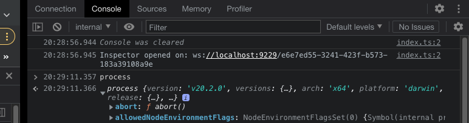
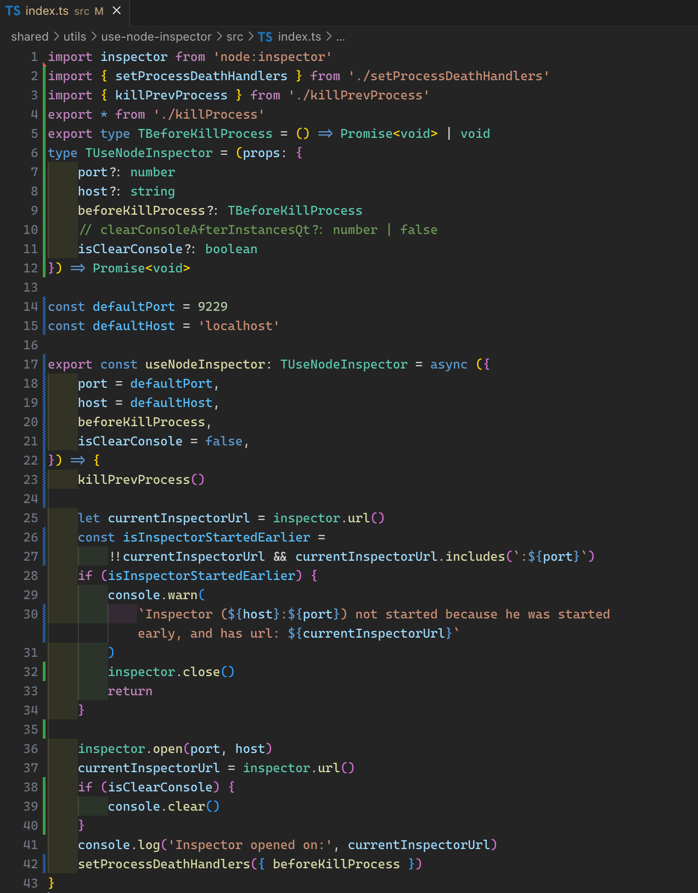
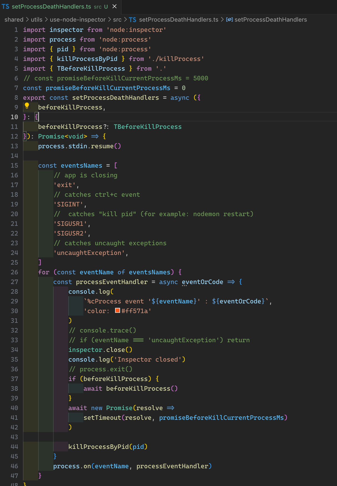
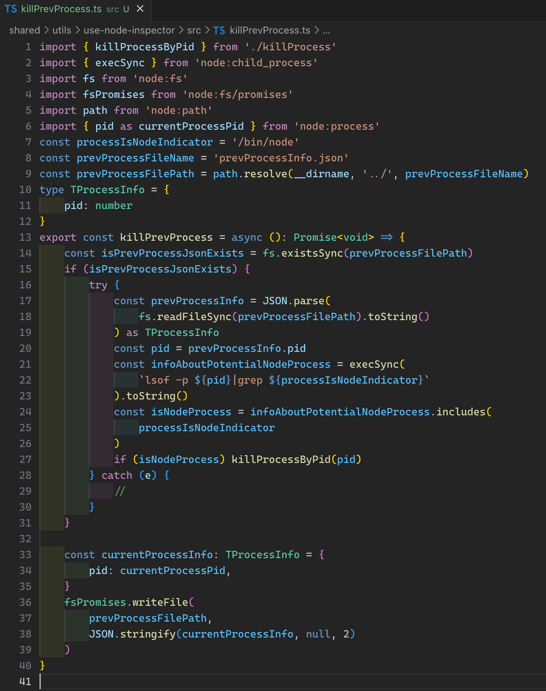
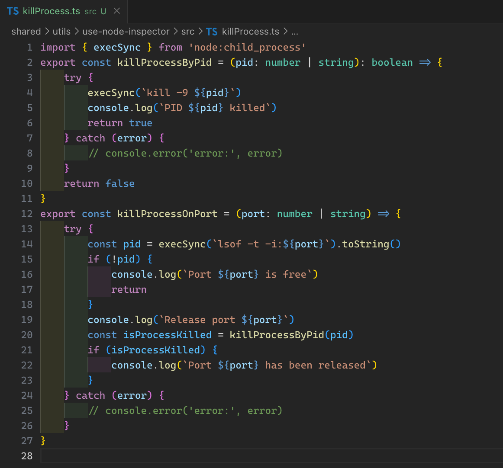

### `isDependenciesFree👌` && `isSimple` && `isPure`

### Did you know that node --inspector can be opened programmatically?

-   However, this often imposes difficulties when the process may not complete correctly and it will run in the background.
-   Unfortunately, this often happens in nodejs applications, when during development you can spawn a huge number of background processes that take up your computer's resources, memory / processor / graphics memory / ...
-   For example if you used `nodemon` / `hot module replacement` (create new instance of any child process, use `killProcessOnPort`, `killProcessByPid`) / ...

### This package tries to solve this problem by adding a function to kill the current process for sure, as well as giving you functions to manually close a process by its pid or port.

```ts
import { killProcessOnPort, killProcessByPid } from 'use-node-inspector'
```

## Note: `worked only in darwin || linux`, maybe later will be added windows (version 3)

##### `This is version 2 and it takes into account the shortcomings of the first version`

## How it works:

## 1. Call `useNodeInspector` anywhere (probably the beginning of the program)

```ts
import { useNodeInspector, killProcessOnPort } from 'use-node-inspector'
useNodeInspector({
    port: 9229,
    // current process will not be killed until all async operation are completed
    beforeKillProcess: async () => {
        // async example operation
        await new Promise(resolve => anyCallBackForExample(resolve))
        // for example you need killed your db connection process / web sockets / express / koa / any
        killProcessOnPort(6969)
    },
    // if not clear console your will have log with previous processes
    isClearConsole: true,
})
```

## 2. Open debugger


## 3. And you will have



# Take it easy

### Under the hood

### 1. Start



### 2. process.stdin.resume and listen 'exit', 'SIGINT', 'SIGUSR1', 'SIGUSR2', 'uncaughtException'



### 3. If for some reason a previous unfinished process is found, it will be killed. The process is recorded in prevProcessInfo.json (write/rewrite auto)

```ts
type TProcessInfo = {
    pid: number
}
```



### Utils `kill process on port`, `kill process by pid`


